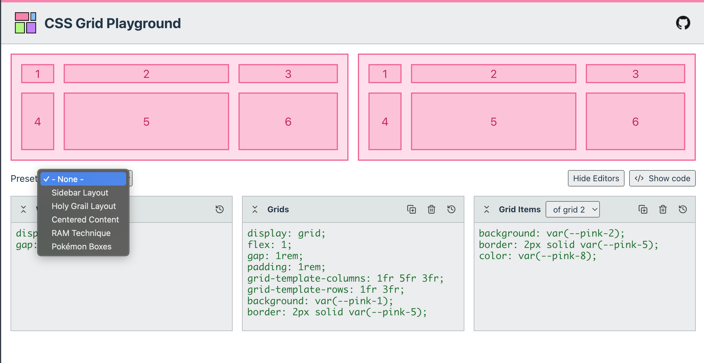

# Super Pokédex Tracker

A simple, lightweight, and client-based Pokédex Tracker.

Brought to you by the [SuperEffective](https://supereffective.gg/) team.



## Features

- [ ] National Pokédex mode as the default
- [ ] Mark all games that you own
- [ ] Track all regional Pokédexes, for all main series games
- [ ] Track all forms, genders and shiny variants
- [ ] Editabe Pokémon data: seen/ready, caught, gender (m/f/-), shiny
- [ ] Search for Pokémon by name, type, color, dex number, etc.
- [ ] View Pokémon basic details such as location, stats, types, and abilities
- [ ] Direct links to well-known Pokémon resource websites
- [ ] Random Shiny Hunting challenge: from all games that you own, this widget will challengee you to hunt a shiny
      Pokémon that you don't own yet.
- [ ] Trade Box: A simple box with 30 slots to store Pokémon (incl. form. gender and shinyness). It is shareable via a
      link, so you can share your box with friends or on social media. The box title and color are editable.
      Unfortunatelly, since this is a client-only webapp, these links can become very large, so we can't guarantee that
      all social media platforms will accept them.

Compared to the original SuperEffective.gg project, this webapp doesn't require a server to run: it stores all your data
locally in your browser's storage. This means you don't need a login, you can use it locally, and you don't have to
worry about your data being stored in an external server.

This webapp is just a Pokédex tracker, not a Living Dex Box Organizer. If you're looking for a Living Dex Box Organizer
check out our main, cloud based project: [supereffective.gg](https://supereffective.gg/).

## Tech Stack

- Bun as a JS runtime, bundler and package manager
- [Vite + React.js + SWC](https://github.com/vitejs/vite-plugin-react-swc)
- SCSS Modules + OpenProps for styling
- TanStack Query + Zustand for state management
- localStorage to persist state
- SuperEffective's CDN for data and images (via https://github.com/supeffective)
- URL as the state for sharing functionality
- Github Actions as CI/CD
- Github Pages for deployments

SVG Icons are from lucide.dev and simpleicons.org

## Development

To develop this project, first, you will need [Bun](https://bun.sh/) 1.0.20 or higher installed on your machine. Then,
you can run the following commands after cloning this repository, to get started:

```bash
bun install
bun run dev
```

## License

This project is licensed under the MIT License - see the [LICENSE](LICENSE) file for details.

## Acknowledgments
